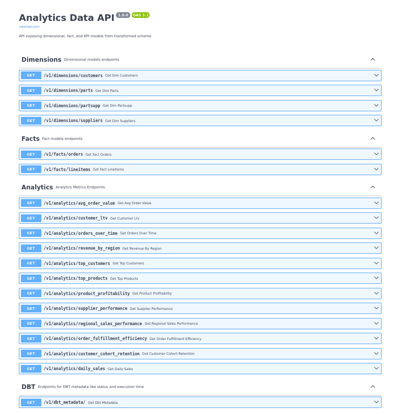
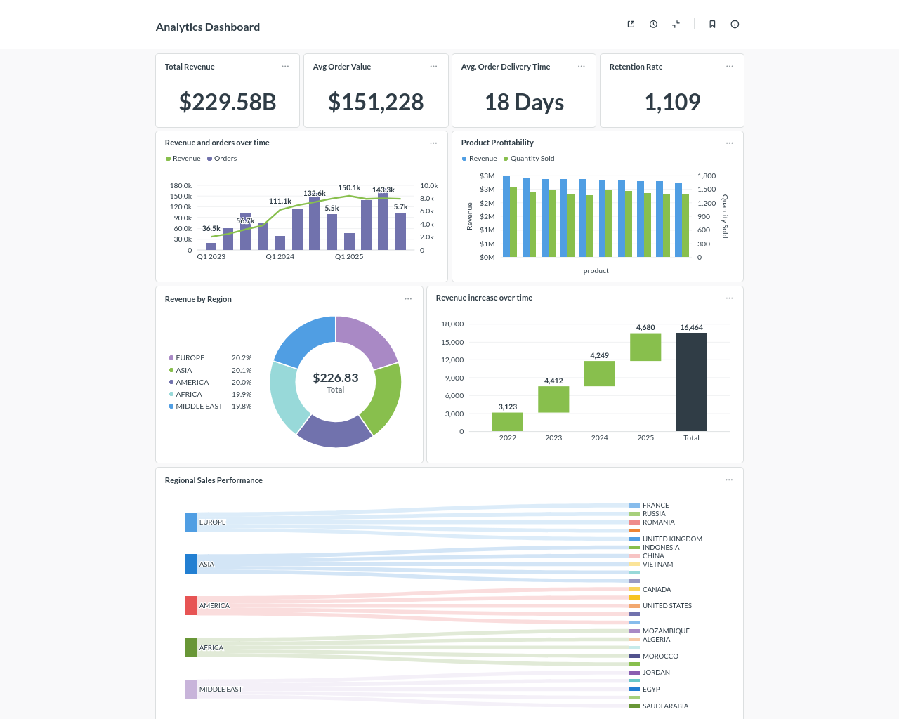

# 🚀 End-to-End Analytics Engineering Platform  
**TPCH · Airflow · dbt · FastAPI · Metabase**

A **production-style analytics engineering project** that demonstrates how raw data moves from ingestion → transformation → orchestration → APIs → BI dashboards using modern data stack tools.

This project is designed to **mirror real-world data platforms** used by Analytics Engineers, Data Engineers, and BI teams.

---

## 🧠 Project Overview

This repository implements a **complete analytics workflow**:

1. **Data Ingestion** – Load TPCH-style data into Postgres  
2. **Transformations (dbt)** – Build staging, marts, and analytics models  
3. **Orchestration (Airflow)** – Schedule ingestion and dbt runs  
4. **Serving Layer (FastAPI)** – Expose analytics KPIs via REST APIs  
5. **BI & Dashboards (Metabase)** – Explore data visually  

The result is a **fully containerized analytics platform** you can run locally.

---

## 🏗️ Architecture

---

## 🔧 Tech Stack

| Layer            | Tool |
|------------------|------|
| Database         | PostgreSQL |
| Transformations  | dbt |
| Orchestration    | Apache Airflow |
| API Layer        | FastAPI |
| BI / Dashboards  | Metabase |
| Containerization | Docker & Docker Compose |

---

## 📊 dbt Features Used
- Staging → Marts → Analytics layers
- Tests & custom tests
- Incremental models
- SCD snapshots
- Documentation generation

---

## ⏱️ Airflow Orchestration

Airflow orchestrates the entire pipeline:

- Warehouse readiness checks
- Ingestion tasks
- dbt run & dbt test
- Retry handling and logging

Each step is **modular, observable, and production-aligned**.

---

# FastAPI Swagger UI

# Metabase Dashboard

